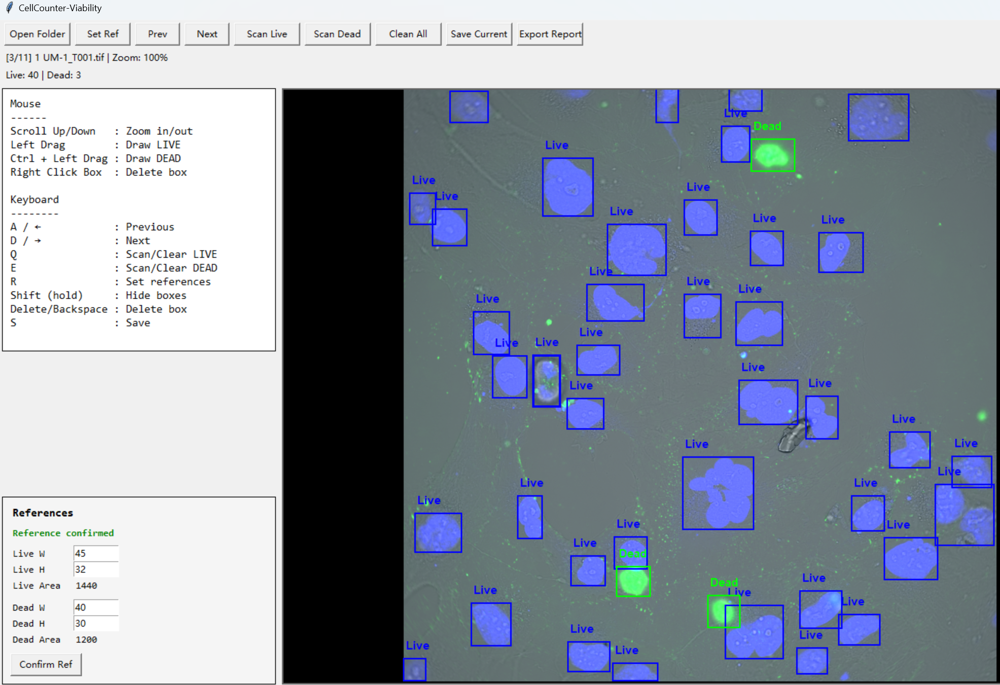

# CellCounter-Viability

## Preview



Interactive tool for live/dead cell annotation and viability analysis in microscopy images.

---

## Features

- Automatic detection of **live cells (blue)**
- Automatic detection of **dead cells (green)**
- Manual correction with bounding boxes
- Mouse wheel zoom (focus on cursor)
- Hold **Shift** to temporarily hide all boxes
- Fast keyboard shortcuts for efficient workflow
- Automatic saving of annotations and preview images
- Export per-image and summary Excel reports
- Customizable minimum cell size using reference selection
- Editable reference width/height directly in UI

---

## Installation

```bash
pip install -r requirements.txt
```

---

## Run

```bash
python cell_counter.py
```

---

## Workflow

1. Click **Open Folder**
2. Select the **root dataset folder**
   - ⚠️ Do NOT select `_viability_ui_output`
3. The first image will open
4. Draw a box around the **minimum LIVE cell**
5. Draw a box around the **minimum DEAD cell**
6. Click **Confirm Ref** to apply the values
7. The program will automatically detect both live and dead cells
8. Manually correct boxes if needed
9. Export results when finished

---

## Important Interaction Design

### Reference Confirmation System

- When you modify reference width/height:
  - The system enters a **"pending confirmation" state**
  - The **Confirm Ref** button becomes highlighted
  - Most operations are temporarily disabled

- You must click **Confirm Ref** to:
  - Apply the new thresholds
  - Unlock all functions

This prevents accidental analysis using incorrect parameters.

---

## Mouse Controls

- **Scroll Up / Down** → Zoom in / out
- **Left Drag** → Draw LIVE cell box
- **Ctrl + Left Drag** → Draw DEAD cell box
- **Right Click on Box** → Delete box

---

## Keyboard Shortcuts

- **A / ←** → Previous image  
- **D / →** → Next image  
- **Q** → Scan / Clear LIVE boxes  
- **E** → Scan / Clear DEAD boxes  
- **R** → Set reference again  
- **Shift (hold)** → Hide all boxes  
- **Delete / Backspace** → Delete selected box  
- **S** → Save current image  

---

## Output Structure

```text
_viability_ui_output/
├── annotations.json
├── annotated_preview/
├── viability_counts_reviewed.xlsx
├── viability_summary_reviewed.xlsx
```

---

## Notes

- Always open the **root dataset folder**
- The tool automatically ignores `_viability_ui_output`
- Preview images are saved automatically during navigation
- Auto-detection is not perfect — manual correction is expected

---

## Author

Dr. Yuan Tian  
UNSW Sydney alumnus
